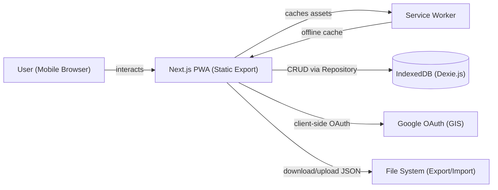
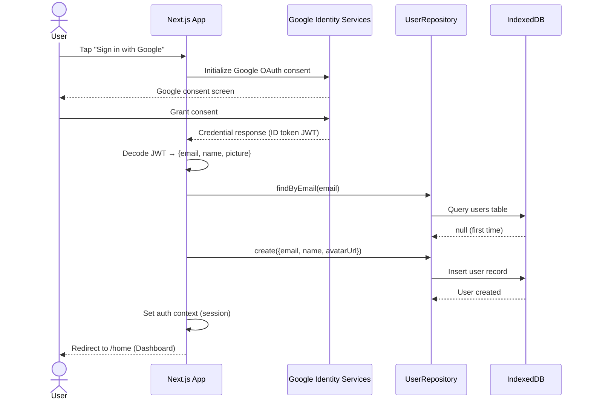
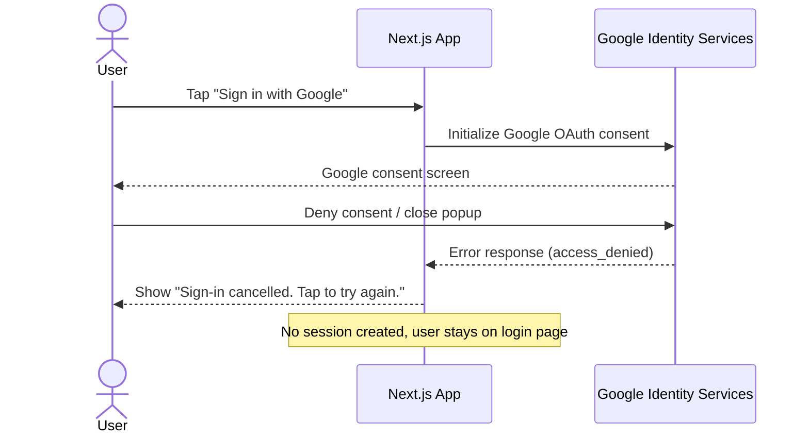
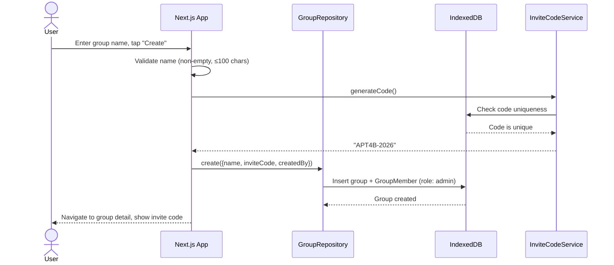
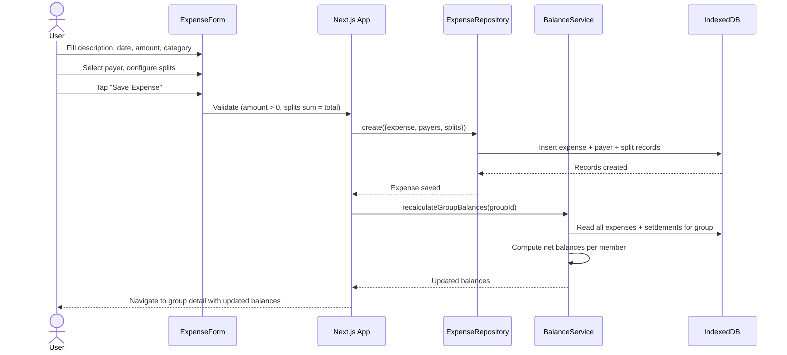
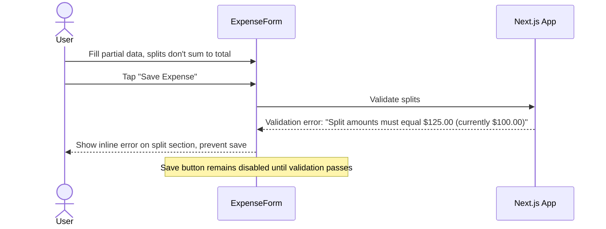
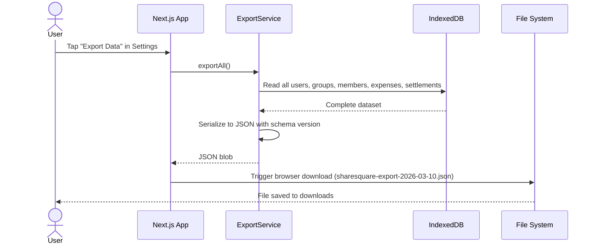
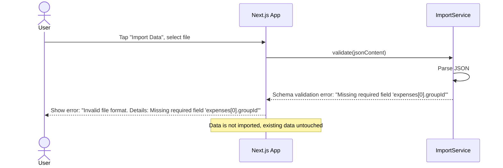

# Design: ShareSquare
> Version: 0.1 | Status: Draft | Last updated: 2026-03-10
> Implements: spec.md v0.1

---

## 1. Architecture Overview

ShareSquare is a client-only Progressive Web App with zero backend infrastructure. All data lives in the browser's IndexedDB, accessed through a repository abstraction layer. Google OAuth runs entirely client-side using Google Identity Services, with the ID token decoded locally to extract profile data. The app is built with Next.js configured for static export, producing a set of HTML/JS/CSS files deployable to any static host.



### Key Architectural Decisions

| Decision | Choice | Rationale |
|----------|--------|-----------|
| No backend server | Client-only PWA | MVP scope — local-first, zero infrastructure cost |
| IndexedDB via Dexie.js | Dexie v4 | Type-safe, reactive queries (`useLiveQuery`), schema versioning |
| Repository pattern | Interface + IndexedDB impl | Future-proofs for Supabase/Firebase swap |
| Static export | `next export` | Deploy anywhere (Vercel, Netlify, S3, GitHub Pages) |
| Client-side Google OAuth | Google Identity Services | No backend needed for token exchange |

---

## 2. Tech Stack

| Layer | Technology | Version | Rationale |
|-------|-----------|---------|-----------|
| Framework | Next.js (App Router) | 15.x | Static export, file-based routing, React Server Components disabled for client-only |
| UI Library | React | 19.x | Component model, hooks, ecosystem |
| Language | TypeScript | 5.x | Type safety across data layer and UI |
| Styling | Tailwind CSS | 4.x | Utility-first, matches mobile-first design, rapid iteration |
| Database | Dexie.js (IndexedDB) | 4.x | Typed IndexedDB wrapper with reactive live queries |
| Auth | @react-oauth/google | 0.12.x | Client-side Google OAuth 2.0 flow |
| PWA | @serwist/next + serwist | 9.x | Service worker generation, precaching, offline support |
| IDs | nanoid | 5.x | Compact, URL-safe unique IDs |
| Testing | Jest + React Testing Library | 29.x / 16.x | Unit + component tests |
| Linting | ESLint + Prettier | 9.x / 3.x | Code quality and formatting |

---

## 3. Sequence Diagrams

### 3.1 Google OAuth Sign-In (Happy Path)



### 3.2 Google OAuth Sign-In (Error Path)



### 3.3 Create Group (Happy Path)



### 3.4 Add Expense (Happy Path)



### 3.5 Add Expense (Validation Error Path)



### 3.6 Data Export (Happy Path)



### 3.7 Data Import (Error Path)



---

## 4. Repository Interfaces (API Contracts)

Since ShareSquare has no backend API, the "API contracts" are the repository interfaces. These are the boundaries between UI and data layer. Any future backend migration implements these same interfaces.

### IUserRepository

```typescript
interface IUserRepository {
  findById(id: string): Promise<User | undefined>;
  findByEmail(email: string): Promise<User | undefined>;
  create(user: Omit<User, 'id' | 'createdAt'>): Promise<User>;
  getAll(): Promise<User[]>;
}
```

### IGroupRepository

```typescript
interface IGroupRepository {
  findById(id: string): Promise<Group | undefined>;
  findByInviteCode(code: string): Promise<Group | undefined>;
  getByUserId(userId: string): Promise<Group[]>;
  create(group: Omit<Group, 'id' | 'createdAt'>): Promise<Group>;
  update(id: string, updates: Partial<Group>): Promise<Group>;
  delete(id: string): Promise<void>;
  addMember(groupId: string, userId: string, role: 'admin' | 'member'): Promise<GroupMember>;
  getMembers(groupId: string): Promise<GroupMember[]>;
  isMember(groupId: string, userId: string): Promise<boolean>;
}
```

### IExpenseRepository

```typescript
interface IExpenseRepository {
  findById(id: string): Promise<Expense | undefined>;
  getByGroupId(groupId: string): Promise<Expense[]>;
  create(expense: Omit<Expense, 'id' | 'createdAt' | 'updatedAt'>,
         payers: Omit<ExpensePayer, 'expenseId'>[],
         splits: Omit<ExpenseSplit, 'expenseId'>[]): Promise<Expense>;
  update(id: string, expense: Partial<Expense>,
         payers?: Omit<ExpensePayer, 'expenseId'>[],
         splits?: Omit<ExpenseSplit, 'expenseId'>[]): Promise<Expense>;
  delete(id: string): Promise<void>;
  getPayers(expenseId: string): Promise<ExpensePayer[]>;
  getSplits(expenseId: string): Promise<ExpenseSplit[]>;
}
```

### ISettlementRepository

```typescript
interface ISettlementRepository {
  findById(id: string): Promise<Settlement | undefined>;
  getByGroupId(groupId: string): Promise<Settlement[]>;
  create(settlement: Omit<Settlement, 'id' | 'createdAt'>): Promise<Settlement>;
  delete(id: string): Promise<void>;
}
```

### IActivityRepository

```typescript
interface IActivityRepository {
  getByUserId(userId: string, limit?: number): Promise<ActivityEntry[]>;
  log(entry: Omit<ActivityEntry, 'id' | 'timestamp'>): Promise<ActivityEntry>;
}
```

**Error Handling Convention:**
- Repository methods throw typed errors: `NotFoundError`, `DuplicateError`, `ValidationError`
- Service layer catches and translates to user-friendly messages
- UI layer displays via toast/inline error components

---

## 5. Data Schema (IndexedDB via Dexie.js)

```typescript
// Dexie database definition — db version 1
import Dexie, { Table } from 'dexie';

interface User {
  id: string;             // nanoid
  email: string;          // unique, from Google
  name: string;           // Google display name
  avatarUrl: string;      // Google profile picture
  createdAt: string;      // ISO 8601
}

interface Group {
  id: string;             // nanoid
  name: string;           // max 100 chars
  inviteCode: string;     // unique, uppercase alphanumeric, e.g. "APT4B-2026"
  createdBy: string;      // userId FK
  createdAt: string;      // ISO 8601
}

interface GroupMember {
  id: string;             // nanoid (compound key alternative)
  groupId: string;        // FK → Group.id
  userId: string;         // FK → User.id
  role: 'admin' | 'member';
  joinedAt: string;       // ISO 8601
}

interface Expense {
  id: string;             // nanoid
  groupId: string;        // FK → Group.id
  title: string;          // max 255 chars
  amount: number;         // integer cents (e.g., 12500 = $125.00)
  date: string;           // ISO 8601 date (YYYY-MM-DD)
  category: string;       // from predefined list
  createdBy: string;      // userId FK
  createdAt: string;      // ISO 8601
  updatedAt: string;      // ISO 8601
}

interface ExpensePayer {
  id: string;             // nanoid
  expenseId: string;      // FK → Expense.id
  userId: string;         // FK → User.id
  amount: number;         // integer cents
}

interface ExpenseSplit {
  id: string;             // nanoid
  expenseId: string;      // FK → Expense.id
  userId: string;         // FK → User.id
  amountOwed: number;     // integer cents
}

interface Settlement {
  id: string;             // nanoid
  groupId: string;        // FK → Group.id
  fromUserId: string;     // FK → User.id (payer)
  toUserId: string;       // FK → User.id (receiver)
  amount: number;         // integer cents
  date: string;           // ISO 8601 date
  createdAt: string;      // ISO 8601
}

interface ActivityEntry {
  id: string;             // nanoid
  userId: string;         // FK → User.id (who performed)
  groupId: string;        // FK → Group.id
  type: 'expense_added' | 'expense_edited' | 'expense_deleted'
        | 'settlement_added' | 'member_joined' | 'group_created';
  description: string;    // human-readable summary
  referenceId: string;    // ID of the related entity
  timestamp: string;      // ISO 8601
}

// Dexie schema (indices)
class ShareSquareDB extends Dexie {
  users!: Table<User>;
  groups!: Table<Group>;
  groupMembers!: Table<GroupMember>;
  expenses!: Table<Expense>;
  expensePayers!: Table<ExpensePayer>;
  expenseSplits!: Table<ExpenseSplit>;
  settlements!: Table<Settlement>;
  activityEntries!: Table<ActivityEntry>;

  constructor() {
    super('sharesquare');
    this.version(1).stores({
      users: 'id, &email',
      groups: 'id, &inviteCode, createdBy',
      groupMembers: 'id, groupId, userId, [groupId+userId]',
      expenses: 'id, groupId, date, category, createdBy',
      expensePayers: 'id, expenseId, userId',
      expenseSplits: 'id, expenseId, userId',
      settlements: 'id, groupId, fromUserId, toUserId',
      activityEntries: 'id, userId, groupId, timestamp',
    });
  }
}
```

### Currency Convention
All monetary values are stored as **integer cents** (e.g., `$125.00` → `12500`). Display layer converts to dollars with `(cents / 100).toFixed(2)`. This avoids IEEE 754 floating-point precision issues throughout the stack.

---

## 6. Module / Component Map

### Pages (Next.js App Router)

| Route | File Path | Responsibility |
|-------|-----------|---------------|
| `/` | `src/app/page.tsx` | Landing / Login screen (unauthenticated) |
| `/home` | `src/app/home/page.tsx` | Dashboard with balance summary + recent groups |
| `/groups` | `src/app/groups/page.tsx` | Groups list with create/join actions |
| `/groups/[id]` | `src/app/groups/[id]/page.tsx` | Group detail: balances, expenses, members |
| `/expenses/new` | `src/app/expenses/new/page.tsx` | Add Expense form |
| `/expenses/[id]/edit` | `src/app/expenses/[id]/edit/page.tsx` | Edit Expense form |
| `/activity` | `src/app/activity/page.tsx` | Cross-group activity feed |
| `/settings` | `src/app/settings/page.tsx` | Profile, export/import, preferences |

### Layout

| File Path | Responsibility |
|-----------|---------------|
| `src/app/layout.tsx` | Root layout: providers (Auth, Repository), global styles |
| `src/layouts/AppLayout.tsx` | Authenticated layout: Header + BottomNav + content area |

### Components

| Component | File Path | Responsibility |
|-----------|-----------|---------------|
| Header | `src/components/Header/Header.tsx` | Top bar: logo, user avatar, search |
| BottomNav | `src/components/BottomNav/BottomNav.tsx` | 5-tab bottom navigation bar |
| BalanceCard | `src/components/BalanceCard/BalanceCard.tsx` | Overall balance display card (green) |
| GroupCard | `src/components/GroupCard/GroupCard.tsx` | Group list item with summary info |
| MemberAvatar | `src/components/MemberAvatar/MemberAvatar.tsx` | Circular avatar with fallback initials |
| MemberBalanceList | `src/components/MemberBalanceList/MemberBalanceList.tsx` | List of members with owed/owing amounts |
| ExpenseForm | `src/components/ExpenseForm/ExpenseForm.tsx` | Add/edit expense form with split logic |
| SplitSelector | `src/components/SplitSelector/SplitSelector.tsx` | Equal/exact/percentage split controls |
| ExpenseList | `src/components/ExpenseList/ExpenseList.tsx` | Table of expenses with date, payer, total, split |
| ExpenseFilters | `src/components/ExpenseFilters/ExpenseFilters.tsx` | Filter bar: date, category, amount, sort |
| SettlementForm | `src/components/SettlementForm/SettlementForm.tsx` | Record a settlement between two members |
| InviteCodeInput | `src/components/InviteCodeInput/InviteCodeInput.tsx` | Join group by code entry |
| GroupCreateForm | `src/components/GroupCreateForm/GroupCreateForm.tsx` | Create group form |
| EmptyState | `src/components/EmptyState/EmptyState.tsx` | Reusable empty state with icon + CTA |
| ConfirmDialog | `src/components/ConfirmDialog/ConfirmDialog.tsx` | Reusable confirmation modal |
| Toast | `src/components/Toast/Toast.tsx` | Feedback notifications |

### Services

| Service | File Path | Responsibility |
|---------|-----------|---------------|
| BalanceService | `src/services/balanceService.ts` | Calculate per-group and cross-group net balances |
| DebtSimplificationService | `src/services/debtSimplificationService.ts` | Minimize settlement transactions (greedy algorithm) |
| ExportService | `src/services/exportService.ts` | Serialize all data to JSON with schema version |
| ImportService | `src/services/importService.ts` | Validate + deserialize JSON import |
| InviteCodeService | `src/services/inviteCodeService.ts` | Generate unique human-readable invite codes |
| AuthService | `src/services/authService.ts` | Google OAuth token decode, session management |
| ActivityService | `src/services/activityService.ts` | Log and retrieve activity entries |

### Repositories

| Repository | File Path | Responsibility |
|------------|-----------|---------------|
| IUserRepository | `src/repositories/interfaces/IUserRepository.ts` | User CRUD interface |
| IGroupRepository | `src/repositories/interfaces/IGroupRepository.ts` | Group + member CRUD interface |
| IExpenseRepository | `src/repositories/interfaces/IExpenseRepository.ts` | Expense + payer + split CRUD interface |
| ISettlementRepository | `src/repositories/interfaces/ISettlementRepository.ts` | Settlement CRUD interface |
| IActivityRepository | `src/repositories/interfaces/IActivityRepository.ts` | Activity log interface |
| DexieUserRepository | `src/repositories/indexeddb/UserRepository.ts` | IndexedDB implementation |
| DexieGroupRepository | `src/repositories/indexeddb/GroupRepository.ts` | IndexedDB implementation |
| DexieExpenseRepository | `src/repositories/indexeddb/ExpenseRepository.ts` | IndexedDB implementation |
| DexieSettlementRepository | `src/repositories/indexeddb/SettlementRepository.ts` | IndexedDB implementation |
| DexieActivityRepository | `src/repositories/indexeddb/ActivityRepository.ts` | IndexedDB implementation |
| database.ts | `src/repositories/indexeddb/database.ts` | Dexie DB instance and schema |
| Repository Provider | `src/repositories/index.ts` | Factory that returns the active implementation |

### Contexts & Hooks

| Module | File Path | Responsibility |
|--------|-----------|---------------|
| AuthContext | `src/contexts/AuthContext.tsx` | Current user state, login/logout methods |
| RepositoryContext | `src/contexts/RepositoryContext.tsx` | Provides repository instances to component tree |
| useAuth | `src/hooks/useAuth.ts` | Hook to access auth state |
| useGroups | `src/hooks/useGroups.ts` | Hook for group CRUD + live queries |
| useExpenses | `src/hooks/useExpenses.ts` | Hook for expense CRUD + live queries |
| useBalances | `src/hooks/useBalances.ts` | Hook for computed balances (uses BalanceService) |
| useSettlements | `src/hooks/useSettlements.ts` | Hook for settlement CRUD |

### Utils

| Utility | File Path | Responsibility |
|---------|-----------|---------------|
| currency | `src/utils/currency.ts` | Cents ↔ dollars conversion, formatting ($X.XX) |
| dateUtils | `src/utils/dateUtils.ts` | Date formatting, relative time ("2h ago") |
| validation | `src/utils/validation.ts` | Shared validation (amount, splits sum, required fields) |
| idGenerator | `src/utils/idGenerator.ts` | Wrapper around nanoid for consistent ID generation |

---

## 7. Project Structure

```
sharesquare/
├── public/
│   ├── manifest.json               # PWA manifest
│   ├── sw.js                       # Generated service worker (serwist)
│   ├── icons/                      # PWA icons (192x192, 512x512)
│   └── favicon.ico
├── src/
│   ├── app/                        # Next.js App Router (pages + layouts)
│   │   ├── layout.tsx              # Root layout: providers, global CSS
│   │   ├── page.tsx                # Landing / Login
│   │   ├── home/
│   │   │   └── page.tsx            # Dashboard
│   │   ├── groups/
│   │   │   ├── page.tsx            # Groups list
│   │   │   └── [id]/
│   │   │       └── page.tsx        # Group detail
│   │   ├── expenses/
│   │   │   ├── new/
│   │   │   │   └── page.tsx        # Add Expense
│   │   │   └── [id]/
│   │   │       └── edit/
│   │   │           └── page.tsx    # Edit Expense
│   │   ├── activity/
│   │   │   └── page.tsx            # Activity feed
│   │   └── settings/
│   │       └── page.tsx            # Settings
│   ├── layouts/
│   │   └── AppLayout/
│   │       ├── AppLayout.tsx       # Auth guard + Header + BottomNav
│   │       └── AppLayout.test.tsx
│   ├── components/                 # Reusable UI components (folder-per-component)
│   │   ├── Header/
│   │   │   ├── Header.tsx
│   │   │   ├── Header.test.tsx
│   │   │   └── types.ts
│   │   ├── BottomNav/
│   │   │   ├── BottomNav.tsx
│   │   │   ├── BottomNav.test.tsx
│   │   │   ├── constants.ts
│   │   │   └── types.ts
│   │   ├── BalanceCard/
│   │   ├── GroupCard/
│   │   ├── MemberAvatar/
│   │   ├── MemberBalanceList/
│   │   ├── ExpenseForm/
│   │   ├── SplitSelector/
│   │   ├── ExpenseList/
│   │   ├── ExpenseFilters/
│   │   ├── SettlementForm/
│   │   ├── GroupCreateForm/
│   │   ├── InviteCodeInput/
│   │   ├── EmptyState/
│   │   ├── ConfirmDialog/
│   │   └── Toast/
│   ├── services/                   # Business logic (no UI, no data access)
│   │   ├── authService.ts
│   │   ├── balanceService.ts
│   │   ├── debtSimplificationService.ts
│   │   ├── exportService.ts
│   │   ├── importService.ts
│   │   ├── inviteCodeService.ts
│   │   └── activityService.ts
│   ├── repositories/              # Data access layer
│   │   ├── interfaces/
│   │   │   ├── IUserRepository.ts
│   │   │   ├── IGroupRepository.ts
│   │   │   ├── IExpenseRepository.ts
│   │   │   ├── ISettlementRepository.ts
│   │   │   └── IActivityRepository.ts
│   │   ├── indexeddb/
│   │   │   ├── database.ts
│   │   │   ├── UserRepository.ts
│   │   │   ├── GroupRepository.ts
│   │   │   ├── ExpenseRepository.ts
│   │   │   ├── SettlementRepository.ts
│   │   │   └── ActivityRepository.ts
│   │   └── index.ts
│   ├── contexts/
│   │   ├── AuthContext.tsx
│   │   └── RepositoryContext.tsx
│   ├── hooks/
│   │   ├── useAuth.ts
│   │   ├── useGroups.ts
│   │   ├── useExpenses.ts
│   │   ├── useBalances.ts
│   │   └── useSettlements.ts
│   ├── utils/
│   │   ├── currency.ts
│   │   ├── dateUtils.ts
│   │   ├── validation.ts
│   │   └── idGenerator.ts
│   ├── constants/
│   │   ├── categories.ts
│   │   ├── routes.ts
│   │   └── colors.ts
│   ├── shared/
│   │   └── variables.ts
│   ├── styles/
│   │   └── globals.css
│   └── types/
│       ├── user.ts
│       ├── group.ts
│       ├── expense.ts
│       ├── settlement.ts
│       └── activity.ts
├── agentdocs/                     # Spec-driven documentation
│   ├── spec.md
│   ├── requirements.md
│   ├── design.md
│   ├── tasks.md
│   ├── context.json
│   └── progress/
├── .env.example                   # NEXT_PUBLIC_GOOGLE_CLIENT_ID=<your-id>
├── .gitignore
├── jest.config.ts
├── jest.setup.ts
├── next.config.ts
├── tailwind.config.ts
├── tsconfig.json
├── postcss.config.mjs
├── package.json
└── README.md
```

---

## 8. Commands

```bash
# Development
npm run dev              # Start Next.js dev server with hot reload (localhost:3000)

# Build
npm run build            # Next.js production build (static export to out/)
npm run start            # Serve the static export locally

# Test
npm test                 # Run all tests (Jest)
npm run test:watch       # Watch mode
npm run test:coverage    # Coverage report (target: >80%)

# Code quality
npm run lint             # ESLint check
npm run lint:fix         # Auto-fix ESLint errors
npm run format           # Prettier formatting
npm run format:check     # Check formatting without writing

# Type check
npm run typecheck        # tsc --noEmit
```

---

## 9. Boundaries

```
✅ ALWAYS:
  - Store money as integer cents, display as dollars
  - Run npm test before any commit
  - Use repository interfaces — never call Dexie directly from components or services
  - Follow folder-per-component pattern with types.ts and constants.ts
  - Add data-testid attributes to interactive elements
  - Write tests for every new file

⚠️ ASK FIRST (requires discussion):
  - Adding new npm dependencies
  - Changing the Dexie schema (requires migration plan)
  - Modifying repository interfaces (affects future backend swap)
  - Changing the export/import JSON schema

🚫 NEVER:
  - Commit .env files or Google OAuth credentials
  - Access IndexedDB outside the repository layer
  - Use floating-point dollars for calculations (use cents)
  - Skip validation on expense splits (must always sum to total)
  - Delete data without a confirmation dialog
  - Bypass auth guards on protected routes
```

---

## 10. Open Decisions

| ID | Question | Options | Owner | Due |
|----|----------|---------|-------|-----|
| — | No open decisions | — | — | — |

All architectural decisions have been resolved in this document.

---

## 11. UI Design Specifications

### Color Palette (extracted from screen designs)

| Token | Hex | Usage |
|-------|-----|-------|
| `primary` | `#5B7A5E` | Balance card background, primary actions |
| `primary-dark` | `#4A5A3C` | Header bar, bottom nav background |
| `primary-light` | `#E8F0E8` | Light green backgrounds, hover states |
| `accent` | `#6B8F71` | FAB button, "Save" button, positive balance |
| `surface` | `#FFFFFF` | Card backgrounds, page background |
| `surface-muted` | `#F5F5F5` | Input backgrounds, section dividers |
| `text-primary` | `#2D3436` | Headings, body text |
| `text-secondary` | `#717171` | Labels, timestamps, secondary info |
| `text-on-primary` | `#FFFFFF` | Text on green backgrounds |
| `border` | `#D1D5DB` | Input borders, card borders |
| `owed-badge` | `#7A8B6F` | "YOU OWE" badge background |
| `owing-text` | `#C0392B` | Negative balance / "Owes" text |

### Typography
- Font: System font stack (`-apple-system, BlinkMacSystemFont, 'Segoe UI', Roboto, sans-serif`)
- Headings: `font-semibold` or `font-bold`
- Balance amounts: `text-3xl font-bold` (large display) or `text-lg font-semibold` (inline)
- Body: `text-sm` or `text-base`

### Component Specifications (from screen designs)

**Bottom Nav Bar:**
- Background: `primary-dark` (#4A5A3C)
- 5 items: Dashboard (home), Groups (users), Add Expense (green circle +), Activity (list), Settings (gear)
- Active tab: white icon + label; Inactive: muted white/gray
- Center "+" button: 56px green circle, elevated above the bar

**Balance Card (Dashboard):**
- Rounded rectangle, `primary` background
- "Overall Balance" label → large dollar amount → "OWED" sub-label
- Sub-row: "You Owe" | "Owed to You" with amounts

**Group Card:**
- White card with subtle shadow/border
- Left: category icon (house, plane, coffee)
- Row of member avatars (circular, 32px, green border, overlapping)
- Right side: "Total Expenses: $X" and "YOU OWE $X" / "YOU ARE OWED $X" badge
- Footer: member count + "Active Xh ago"

**Add Expense Form:**
- Back arrow + "Cancel" in top bar
- Vertical form: Description → Date (date picker) → Amount ($ prefix) → Who Paid (dropdown) → Members split section
- "Split Equally" checkbox toggle
- Per-member row: avatar + name + amount input + % toggle button
- "Save Expense" full-width green button at bottom

**Group Detail:**
- Back arrow + group name (editable by admin, pencil icon)
- Summary card: "Group Total Expenses $X" + "Member Balances" with user's net
- Member list: avatar + name + "Owed $X" or "Owes $X"
- "Recent Expenses" table: Date | Payer description | Total | Split columns

---

## 12. Algorithm: Debt Simplification

The debt simplification algorithm minimizes the number of settlement transactions within a group.

### Algorithm (Greedy Net-Balance)

```
Input: List of member net balances [{userId, netBalance}]
  where netBalance = (total paid by user) - (total owed by user) - (settlements sent) + (settlements received)

1. Separate into:
   - creditors: members with netBalance > 0 (are owed money)
   - debtors: members with netBalance < 0 (owe money)

2. Sort creditors descending by amount, debtors ascending by amount (most negative first)

3. While creditors and debtors both non-empty:
   a. Take largest creditor (C) and largest debtor (D)
   b. transferAmount = min(C.balance, abs(D.balance))
   c. Emit settlement: D pays C → transferAmount
   d. C.balance -= transferAmount
   e. D.balance += transferAmount
   f. Remove any with balance == 0

Output: Minimal list of [{from, to, amount}] settlements
```

### Complexity
- Time: O(n log n) for sorting + O(n) for settlement generation = O(n log n)
- Space: O(n) for the creditor/debtor lists

### Correctness Guarantee
The sum of all net balances in a group is always zero (every dollar paid equals every dollar owed). The greedy approach is optimal for minimizing transaction count when there are no constraints on who pays whom.

---

## Code Style Reference

```typescript
// Repository: thin data access, no business logic
export class DexieExpenseRepository implements IExpenseRepository {
  constructor(private db: ShareSquareDB) {}

  async getByGroupId(groupId: string): Promise<Expense[]> {
    return this.db.expenses.where('groupId').equals(groupId).toArray();
  }
}

// Service: business logic, no data access (receives repositories)
export function calculateGroupBalances(
  expenses: Expense[],
  payers: ExpensePayer[],
  splits: ExpenseSplit[],
  settlements: Settlement[],
): Map<string, number> {
  const balances = new Map<string, number>();
  // ... balance calculation logic
  return balances;
}

// Component: thin UI, delegates to hooks
export const GroupCard: React.FC<GroupCardProps> = ({ group, balance, memberCount }) => {
  return (
    <div data-testid={`group-card-${group.id}`} className="bg-white rounded-xl p-4 shadow-sm border border-border">
      {/* ... */}
    </div>
  );
};
```
