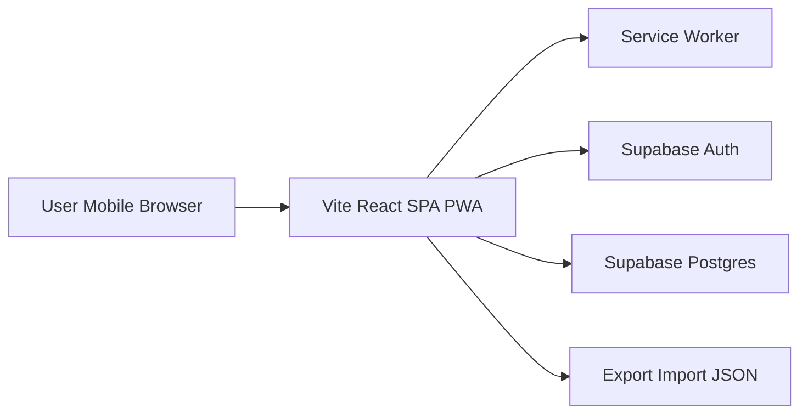
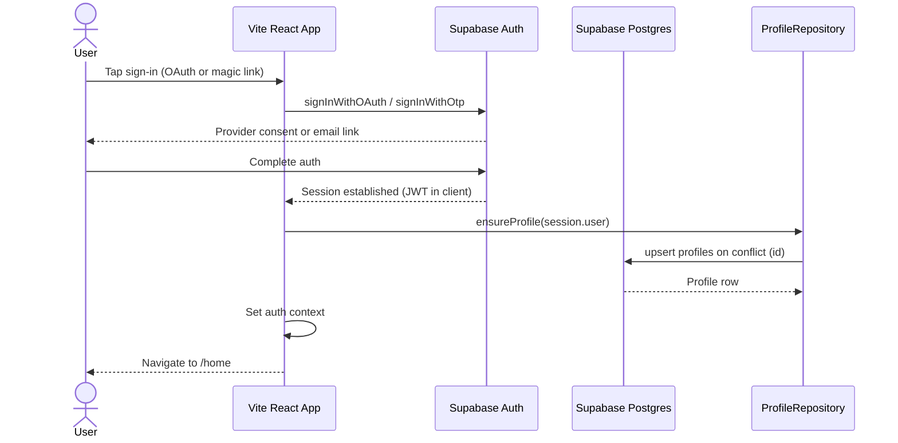
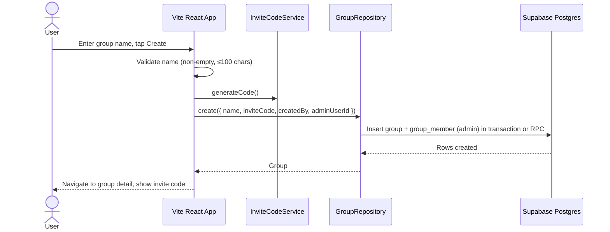
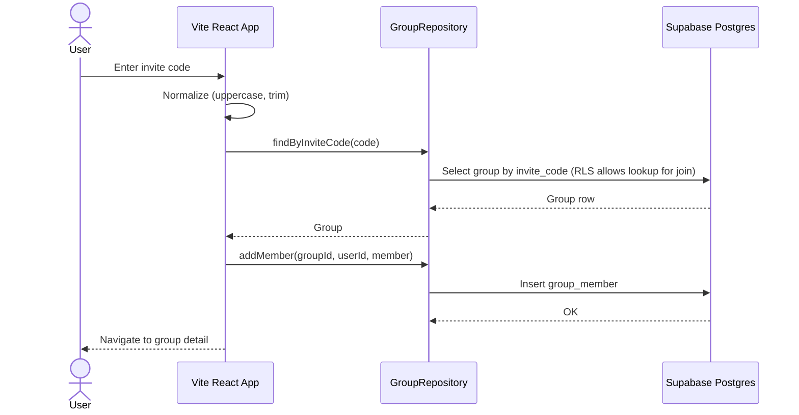
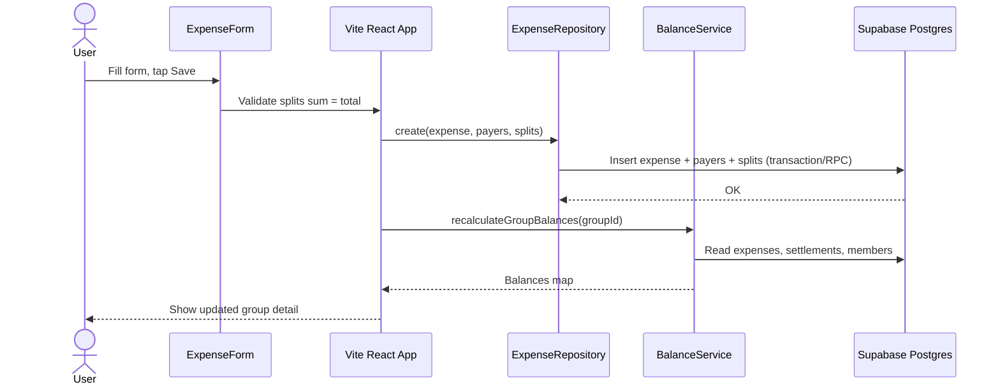
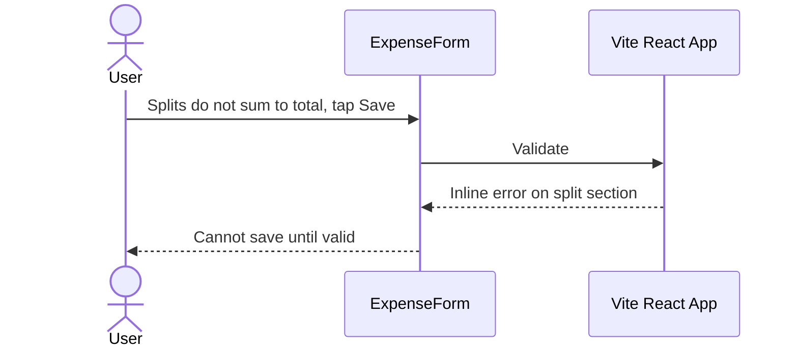
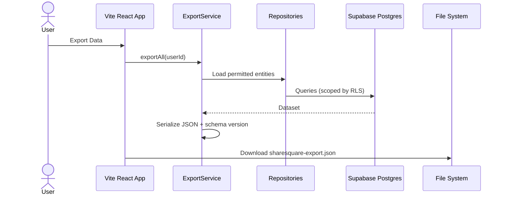

# Design: ShareSquare

> Version: 0.3 | Status: Draft | Last updated: 2026-03-31
> Implements: spec.md v0.2

---

## 1. Architecture Overview

ShareSquare is an **online-first** PWA: a **Vite + React** SPA served as static assets (e.g. Vercel, Netlify, or Cloudflare Pages). **Supabase Auth** handles sign-in and sessions; **Supabase Postgres** is the system of record for groups, expenses, settlements, activity, and invite codes. A **service worker** (via `vite-plugin-pwa`) precaches the app shell and static assets; **data mutations and reads go through the Supabase client** and require network connectivity for MVP. JSON export/import uses the browser file APIs while sourcing or applying data via repositories.



### Key Architectural Decisions

| Decision | Choice | Rationale |
|----------|--------|-----------|
| SPA build | Vite + React + React Router | Simple static deploy; no SSR requirement for MVP |
| Data store | Supabase Postgres | Single source of truth, RLS, matches online-first spec |
| Invite codes | `groups.invite_code` UNIQUE in Postgres | Same DB as app data; no separate KV service |
| Auth | Supabase Auth | Providers and magic link configured in dashboard; JWT handled by client |
| Repository pattern | Interface + Supabase implementation | UI depends on interfaces; swap test fakes without UI churn |
| PWA | `vite-plugin-pwa` (Workbox) | Precache shell/assets; data is not offline-guaranteed |
| Primary keys | UUID | Aligns with `auth.users.id` and Postgres defaults |

---

## 2. Tech Stack

| Layer | Technology | Version | Rationale |
|-------|-----------|---------|-----------|
| Build / dev | Vite | 6.x | Fast HMR, static output, simple SPA |
| Framework | React | 19.x | Component model, hooks |
| Routing | react-router-dom | 7.x | Declarative routes for SPA |
| Backend / DB | Supabase (Postgres + Auth) | latest | Managed Postgres, RLS, Auth, JS client |
| Client SDK | @supabase/supabase-js | latest | Auth session + typed queries/RPC |
| Server state (optional) | @tanstack/react-query | 5.x | Caching, retries, loading states (recommended) |
| UI Library | React (above) | — | — |
| Language | TypeScript | 5.x | Type safety across layers |
| Styling | Tailwind CSS | 4.x | Utility-first, mobile-first |
| PWA | vite-plugin-pwa | latest | Workbox-based SW generation |
| IDs | UUID (`gen_random_uuid()` in DB) | — | Matches Supabase Auth user id |
| Testing | Jest + React Testing Library | 29.x / 16.x | Unit + component tests |
| Linting | ESLint + Prettier | 9.x / 3.x | Code quality |

---

## 3. Sequence Diagrams

### 3.1 Supabase Auth Sign-In (Happy Path)



### 3.2 Supabase Auth Sign-In (Error Path)

```mermaid
sequenceDiagram
  actor User
  participant App as Vite React App
  participant SB as Supabase Auth

  User->>App: Start sign-in
  App->>SB: sign-in request
  SB-->>App: Error (cancelled, invalid, network)
  App-->>User: Show error with retry
  Note over App: No session; user stays on login
```

### 3.3 Create Group (Happy Path)



**Error path:** Unique violation on `invite_code` → regenerate code and retry once. RLS or validation error → show message.

### 3.4 Join Group (Happy Path)



**Error path:** No row → "Code not found." Duplicate membership → "Already a member."

### 3.5 Add Expense (Happy Path)



### 3.6 Add Expense (Validation Error Path)



### 3.7 Data Export (Happy Path)



### 3.8 Data Import (Error Path)

```mermaid
sequenceDiagram
  actor User
  participant App as Vite React App
  participant ImpSvc as ImportService

  User->>App: Import file
  App->>ImpSvc: validate(content)
  ImpSvc-->>App: Schema error details
  App-->>User: Invalid file; existing data unchanged
```

---

## 4. Supabase Surface

There are **no Next.js API routes**. The app talks to Supabase over HTTPS.

### Tables (public schema, illustrative names)

| Table | Purpose |
|-------|---------|
| `profiles` | `id` UUID PK → `auth.users.id`, `email`, `display_name`, `avatar_url`, `created_at` |
| `groups` | Group record; **`invite_code` TEXT UNIQUE NOT NULL** |
| `group_members` | Membership + `role` (`admin` \| `member`) |
| `expenses` | Expense header (amount in **integer cents**) |
| `expense_payers` | Who paid how much (cents) |
| `expense_splits` | Who owes how much (cents) |
| `settlements` | Recorded payments between members |
| `activity_entries` | Optional audit / feed rows |

### RPC / transactions (optional but recommended)

- **`create_group_with_admin`** — single round-trip: insert `groups` + initial `group_members` row as `admin`, returns group.
- **`create_expense_with_splits`** — insert expense + payers + splits atomically.

Naming is indicative; implement with Supabase SQL migrations.

### Auth

- Client uses `createClient` with `VITE_SUPABASE_URL` and `VITE_SUPABASE_ANON_KEY`.
- Requests carry the user JWT automatically; **RLS** enforces access.

### Realtime

- **Out of scope for MVP** unless explicitly added later (live expense feed).

---

## 5. Repository Interfaces (API Contracts)

Repository interfaces remain the boundary between UI and data. **Implementations** live under `src/repositories/supabase/`. Components and services **must not** import `@supabase/supabase-js` directly except inside repository modules (or a thin `supabaseClient` module used only by repositories).

**Auth vs profile:** `AuthContext` holds the Supabase session and `user.id`. `IUserRepository` (or a dedicated `IProfileRepository`) loads/updates `profiles` rows. On first login, the app **upserts** `profiles` from `user.user_metadata` / email.

### IUserRepository

```typescript
interface IUserRepository {
  findById(id: string): Promise<User | undefined>;
  findByEmail(email: string): Promise<User | undefined>;
  create(user: Omit<User, 'id' | 'createdAt'>): Promise<User>;
  getAll(): Promise<User[]>;
}
```

*Note:* In production, `id` for the current user should match `auth.users.id`. `create` may be unused if profiles are created only via Auth trigger + upsert; keep or narrow in implementation as needed.

### IGroupRepository

```typescript
interface IGroupRepository {
  findById(id: string): Promise<Group | undefined>;
  findByInviteCode(code: string): Promise<Group | undefined>;
  getByUserId(userId: string): Promise<Group[]>;
  create(group: Omit<Group, 'id' | 'createdAt'>): Promise<Group>;
  update(id: string, updates: Partial<Group>): Promise<Group>;
  delete(id: string): Promise<void>;
  addMember(groupId: string, userId: string, role: 'admin' | 'member'): Promise<GroupMember>;
  getMembers(groupId: string): Promise<GroupMember[]>;
  isMember(groupId: string, userId: string): Promise<boolean>;
}
```

### IExpenseRepository

```typescript
interface IExpenseRepository {
  findById(id: string): Promise<Expense | undefined>;
  getByGroupId(groupId: string): Promise<Expense[]>;
  create(
    expense: Omit<Expense, 'id' | 'createdAt' | 'updatedAt'>,
    payers: Omit<ExpensePayer, 'expenseId'>[],
    splits: Omit<ExpenseSplit, 'expenseId'>[],
  ): Promise<Expense>;
  update(
    id: string,
    expense: Partial<Expense>,
    payers?: Omit<ExpensePayer, 'expenseId'>[],
    splits?: Omit<ExpenseSplit, 'expenseId'>[],
  ): Promise<Expense>;
  delete(id: string): Promise<void>;
  getPayers(expenseId: string): Promise<ExpensePayer[]>;
  getSplits(expenseId: string): Promise<ExpenseSplit[]>;
}
```

### ISettlementRepository

```typescript
interface ISettlementRepository {
  findById(id: string): Promise<Settlement | undefined>;
  getByGroupId(groupId: string): Promise<Settlement[]>;
  create(settlement: Omit<Settlement, 'id' | 'createdAt'>): Promise<Settlement>;
  delete(id: string): Promise<void>;
}
```

### IActivityRepository

```typescript
interface IActivityRepository {
  getByUserId(userId: string, limit?: number): Promise<ActivityEntry[]>;
  log(entry: Omit<ActivityEntry, 'id' | 'timestamp'>): Promise<ActivityEntry>;
}
```

**Error Handling Convention:**

- Repository methods throw typed errors: `NotFoundError`, `DuplicateError`, `ValidationError`
- Service layer catches and translates to user-friendly messages
- UI layer displays via toast/inline error components

---

## 6. Data Schema (Postgres / TypeScript)

Database columns use **snake_case**; TypeScript domain types may use **camelCase** with mapping at the repository boundary. All monetary fields are **integer cents**.

### SQL tables (illustrative)

```sql
-- profiles: sync with auth.users
create table public.profiles (
  id uuid primary key references auth.users (id) on delete cascade,
  email text,
  display_name text,
  avatar_url text,
  created_at timestamptz default now()
);

create table public.groups (
  id uuid primary key default gen_random_uuid(),
  name text not null,
  invite_code text not null unique,
  created_by uuid not null references auth.users (id),
  created_at timestamptz default now()
);

create table public.group_members (
  id uuid primary key default gen_random_uuid(),
  group_id uuid not null references public.groups (id) on delete cascade,
  user_id uuid not null references auth.users (id) on delete cascade,
  role text not null check (role in ('admin', 'member')),
  joined_at timestamptz default now(),
  unique (group_id, user_id)
);

-- expenses, expense_payers, expense_splits, settlements, activity_entries:
-- mirror spec entities; use uuid PKs, integer amount columns in cents,
-- FKs to groups and auth.users as appropriate.
```

### TypeScript domain types (camelCase)

```typescript
interface User {
  id: string; // uuid, auth.users.id
  email: string;
  name: string;
  avatarUrl: string;
  createdAt: string; // ISO 8601
}

interface Group {
  id: string;
  name: string;
  inviteCode: string;
  createdBy: string;
  createdAt: string;
}

interface GroupMember {
  id: string;
  groupId: string;
  userId: string;
  role: 'admin' | 'member';
  joinedAt: string;
}

interface Expense {
  id: string;
  groupId: string;
  title: string;
  amount: number; // cents
  date: string; // YYYY-MM-DD
  category: string;
  createdBy: string;
  createdAt: string;
  updatedAt: string;
}

interface ExpensePayer {
  id: string;
  expenseId: string;
  userId: string;
  amount: number; // cents
}

interface ExpenseSplit {
  id: string;
  expenseId: string;
  userId: string;
  amountOwed: number; // cents
}

interface Settlement {
  id: string;
  groupId: string;
  fromUserId: string;
  toUserId: string;
  amount: number; // cents
  date: string;
  createdAt: string;
}

interface ActivityEntry {
  id: string;
  userId: string;
  groupId: string;
  type:
    | 'expense_added'
    | 'expense_edited'
    | 'expense_deleted'
    | 'settlement_added'
    | 'member_joined'
    | 'group_created';
  description: string;
  referenceId: string;
  timestamp: string;
}
```

### Row Level Security (policy intent)

- **`profiles`:** Users can read/update **their own** row (`id = auth.uid()`).
- **`groups`:** Members can read groups they belong to; authenticated users can **insert** a group they create; only admins (or creator) can update/delete per product rules.
- **`group_members`:** Users can read members of groups they belong to; inserts allowed when joining (subject to invite validation) or when admin adds; policies must prevent arbitrary cross-tenant reads.
- **`expenses`, `expense_payers`, `expense_splits`:** CRUD only for users who are members of the expense's group; edit/delete per BR-04.
- **`settlements`:** Same group membership rules.
- **`activity_entries`:** Read for users who share the group context; insert via app or trigger as designed.

Exact SQL policies ship with migrations; the above is the **intent** for spec alignment.

### Currency Convention

All monetary values are stored as **integer cents**. Display uses `(cents / 100).toFixed(2)`.

---

## 7. Module / Component Map

### Routes (React Router)

| Path | Page component | Responsibility |
|------|----------------|----------------|
| `/` | `LandingPage` | Landing / login (unauthenticated) |
| `/home` | `HomePage` | Dashboard |
| `/groups` | `GroupsPage` | Groups list, create/join |
| `/groups/:id` | `GroupDetailPage` | Balances, expenses, members |
| `/expenses/new` | `NewExpensePage` | Add expense |
| `/expenses/:id/edit` | `EditExpensePage` | Edit expense |
| `/activity` | `ActivityPage` | Activity feed |
| `/settings` | `SettingsPage` | Profile, export/import |

### Layout

| File Path | Responsibility |
|-----------|----------------|
| `src/App.tsx` | Router definition, route guards |
| `src/layouts/AppLayout/AppLayout.tsx` | Authenticated shell: Header + BottomNav |

### Components

| Component | File Path | Responsibility |
|-----------|-----------|----------------|
| Header | `src/components/Header/Header.tsx` | Top bar: logo, user avatar |
| BottomNav | `src/components/BottomNav/BottomNav.tsx` | 5-tab bottom navigation |
| BalanceCard | `src/components/BalanceCard/BalanceCard.tsx` | Overall balance card |
| GroupCard | `src/components/GroupCard/GroupCard.tsx` | Group list item |
| MemberAvatar | `src/components/MemberAvatar/MemberAvatar.tsx` | Avatar + initials |
| MemberBalanceList | `src/components/MemberBalanceList/MemberBalanceList.tsx` | Member balances |
| ExpenseForm | `src/components/ExpenseForm/ExpenseForm.tsx` | Add/edit expense |
| SplitSelector | `src/components/SplitSelector/SplitSelector.tsx` | Split controls |
| ExpenseList | `src/components/ExpenseList/ExpenseList.tsx` | Expense table |
| ExpenseFilters | `src/components/ExpenseFilters/ExpenseFilters.tsx` | Filters |
| SettlementForm | `src/components/SettlementForm/SettlementForm.tsx` | Record settlement |
| InviteCodeInput | `src/components/InviteCodeInput/InviteCodeInput.tsx` | Join by code |
| GroupCreateForm | `src/components/GroupCreateForm/GroupCreateForm.tsx` | Create group |
| EmptyState | `src/components/EmptyState/EmptyState.tsx` | Empty states |
| ConfirmDialog | `src/components/ConfirmDialog/ConfirmDialog.tsx` | Confirm modals |
| Toast | `src/components/Toast/Toast.tsx` | Notifications |

### Services

| Service | File Path | Responsibility |
|---------|-----------|----------------|
| BalanceService | `src/services/balanceService.ts` | Net balances, debt simplification input |
| DebtSimplificationService | `src/services/debtSimplificationService.ts` | Minimize transactions |
| ExportService | `src/services/exportService.ts` | JSON export |
| ImportService | `src/services/importService.ts` | JSON import validation |
| InviteCodeService | `src/services/inviteCodeService.ts` | Generate invite codes |
| Auth helpers | `src/services/authService.ts` | Thin wrappers around Supabase Auth if needed |
| ActivityService | `src/services/activityService.ts` | Activity log |

### Repositories

| Repository | File Path | Responsibility |
|------------|-----------|----------------|
| Interfaces | `src/repositories/interfaces/*.ts` | Contracts |
| Supabase implementations | `src/repositories/supabase/*Repository.ts` | Postgres via Supabase client |
| Client singleton | `src/repositories/supabase/client.ts` | `createBrowserClient` / `createClient` |
| Factory | `src/repositories/index.ts` | Export repository instances |

### Contexts & Hooks

| Module | File Path | Responsibility |
|--------|-----------|----------------|
| AuthContext | `src/contexts/AuthContext.tsx` | Supabase session, sign-in/out |
| RepositoryContext | `src/contexts/RepositoryContext.tsx` | Inject repositories |
| useAuth | `src/hooks/useAuth.ts` | Auth state |
| useGroups | `src/hooks/useGroups.ts` | Groups CRUD + loading |
| useExpenses | `src/hooks/useExpenses.ts` | Expenses |
| useBalances | `src/hooks/useBalances.ts` | Balances |
| useSettlements | `src/hooks/useSettlements.ts` | Settlements |

### Utils

| Utility | File Path | Responsibility |
|---------|-----------|----------------|
| currency | `src/utils/currency.ts` | Cents ↔ display |
| dateUtils | `src/utils/dateUtils.ts` | Formatting |
| validation | `src/utils/validation.ts` | Shared validation |
| rowMapping | `src/utils/rowMapping.ts` | snake_case ↔ domain types (optional) |

---

## 8. Project Structure

```
sharesquare/
├── index.html
├── public/
│   ├── icons/                      # PWA icons
│   └── favicon.ico
├── src/
│   ├── main.tsx
│   ├── App.tsx
│   ├── vite-env.d.ts
│   ├── pages/
│   │   ├── LandingPage.tsx
│   │   ├── HomePage.tsx
│   │   ├── GroupsPage.tsx
│   │   ├── GroupDetailPage.tsx
│   │   ├── NewExpensePage.tsx
│   │   ├── EditExpensePage.tsx
│   │   ├── ActivityPage.tsx
│   │   └── SettingsPage.tsx
│   ├── layouts/
│   │   └── AppLayout/
│   │       ├── AppLayout.tsx
│   │       └── AppLayout.test.tsx
│   ├── components/                 # folder-per-component
│   │   ├── Header/
│   │   ├── BottomNav/
│   │   └── ...
│   ├── services/
│   ├── repositories/
│   │   ├── interfaces/
│   │   ├── supabase/
│   │   │   ├── client.ts
│   │   │   ├── UserRepository.ts
│   │   │   ├── GroupRepository.ts
│   │   │   ├── ExpenseRepository.ts
│   │   │   ├── SettlementRepository.ts
│   │   │   └── ActivityRepository.ts
│   │   └── index.ts
│   ├── contexts/
│   ├── hooks/
│   ├── utils/
│   ├── constants/
│   ├── shared/
│   ├── styles/
│   │   └── globals.css
│   └── types/
├── agentdocs/
├── supabase/                       # migrations, config (optional folder)
├── .env.example                    # VITE_SUPABASE_URL, VITE_SUPABASE_ANON_KEY
├── vite.config.ts
├── tsconfig.json
├── tailwind.config.ts
├── postcss.config.mjs
├── jest.config.ts
├── jest.setup.ts
├── eslint.config.js
├── package.json
└── README.md
```

---

## 9. Commands

```bash
# Development
npm run dev                 # Vite dev server (default http://localhost:5173)

# Build
npm run build               # vite build → static dist/

# Preview production build locally
npm run preview             # vite preview

# Test
npm test
npm run test:watch
npm run test:coverage

# Code quality
npm run lint
npm run lint:fix
npm run format
npm run format:check

# Type check
npm run typecheck           # tsc --noEmit
```

---

## 10. Boundaries

```
✅ ALWAYS:
  - Store money as integer cents, display as dollars
  - Run npm test before any commit
  - Use repository interfaces — do not query Postgres from components except via repositories
  - Follow folder-per-component pattern with types.ts and constants.ts where applicable
  - Add data-testid on interactive elements
  - Write tests for every new file
  - Apply schema changes via Supabase migrations (versioned SQL), not ad-hoc dashboard edits in production

⚠️ ASK FIRST:
  - Adding new npm dependencies
  - Changing RLS policies or table shapes (security impact)
  - Modifying repository interfaces
  - Changing the export/import JSON schema

🚫 NEVER:
  - Commit .env files or Supabase service role keys to the repo
  - Use the service role key in browser code
  - Use floating-point dollars for calculations (use cents)
  - Skip validation on expense splits
  - Delete data without confirmation
  - Bypass auth guards on protected routes
  - Assume offline writes will succeed without handling network errors
```

---

## 11. Open Decisions

| ID | Question | Options | Owner | Due |
|----|----------|---------|-------|-----|
| — | No open decisions | — | — | — |

All architectural decisions have been resolved in this document.

---

## 12. UI Design Specifications

### Color Palette (extracted from screen designs)

| Token | Hex | Usage |
|-------|-----|-------|
| `primary` | `#5B7A5E` | Balance card background, primary actions |
| `primary-dark` | `#4A5A3C` | Header bar, bottom nav background |
| `primary-light` | `#E8F0E8` | Light green backgrounds, hover states |
| `accent` | `#6B8F71` | FAB button, "Save" button, positive balance |
| `surface` | `#FFFFFF` | Card backgrounds, page background |
| `surface-muted` | `#F5F5F5` | Input backgrounds, section dividers |
| `text-primary` | `#2D3436` | Headings, body text |
| `text-secondary` | `#717171` | Labels, timestamps, secondary info |
| `text-on-primary` | `#FFFFFF` | Text on green backgrounds |
| `border` | `#D1D5DB` | Input borders, card borders |
| `owed-badge` | `#7A8B6F` | "YOU OWE" badge background |
| `owing-text` | `#C0392B` | Negative balance / "Owes" text |

### Typography

- Font: System font stack (`-apple-system, BlinkMacSystemFont, 'Segoe UI', Roboto, sans-serif`)
- Headings: `font-semibold` or `font-bold`
- Balance amounts: `text-3xl font-bold` (large display) or `text-lg font-semibold` (inline)
- Body: `text-sm` or `text-base`

### Component Specifications (from screen designs)

**Bottom Nav Bar:**

- Background: `primary-dark` (#4A5A3C)
- 5 items: Dashboard (home), Groups (users), Add Expense (green circle +), Activity (list), Settings (gear)
- Active tab: white icon + label; Inactive: muted white/gray
- Center "+" button: 56px green circle, elevated above the bar

**Balance Card (Dashboard):**

- Rounded rectangle, `primary` background
- "Overall Balance" label → large dollar amount → "OWED" sub-label
- Sub-row: "You Owe" | "Owed to You" with amounts

**Group Card:**

- White card with subtle shadow/border
- Left: category icon (house, plane, coffee)
- Row of member avatars (circular, 32px, green border, overlapping)
- Right side: "Total Expenses: $X" and "YOU OWE $X" / "YOU ARE OWED $X" badge
- Footer: member count + "Active Xh ago"

**Add Expense Form:**

- Back arrow + "Cancel" in top bar
- Vertical form: Description → Date (date picker) → Amount ($ prefix) → Who Paid (dropdown) → Members split section
- "Split Equally" checkbox toggle
- Per-member row: avatar + name + amount input + % toggle button
- "Save Expense" full-width green button at bottom

**Group Detail:**

- Back arrow + group name (editable by admin, pencil icon)
- Summary card: "Group Total Expenses $X" + "Member Balances" with user's net
- Member list: avatar + name + "Owed $X" or "Owes $X"
- "Recent Expenses" table: Date | Payer description | Total | Split columns

---

## 13. Algorithm: Debt Simplification

The debt simplification algorithm minimizes the number of settlement transactions within a group.

### Algorithm (Greedy Net-Balance)

```
Input: List of member net balances [{userId, netBalance}]
  where netBalance = (total paid by user) - (total owed by user) - (settlements sent) + (settlements received)

1. Separate into:
   - creditors: members with netBalance > 0 (are owed money)
   - debtors: members with netBalance < 0 (owe money)

2. Sort creditors descending by amount, debtors ascending by amount (most negative first)

3. While creditors and debtors both non-empty:
   a. Take largest creditor (C) and largest debtor (D)
   b. transferAmount = min(C.balance, abs(D.balance))
   c. Emit settlement: D pays C → transferAmount
   d. C.balance -= transferAmount
   e. D.balance += transferAmount
   f. Remove any with balance == 0

Output: Minimal list of [{from, to, amount}] settlements
```

### Complexity

- Time: O(n log n) for sorting + O(n) for settlement generation = O(n log n)
- Space: O(n) for the creditor/debtor lists

### Correctness Guarantee

The sum of all net balances in a group is always zero (every dollar paid equals every dollar owed). The greedy approach is optimal for minimizing transaction count when there are no constraints on who pays whom.

---

## Code Style Reference

```typescript
// Repository: thin data access, no business logic
export class SupabaseExpenseRepository implements IExpenseRepository {
  constructor(private client: SupabaseClient) {}

  async getByGroupId(groupId: string): Promise<Expense[]> {
    const { data, error } = await this.client
      .from('expenses')
      .select('*')
      .eq('group_id', groupId);
    if (error) throw error;
    return (data ?? []).map(mapExpenseRow);
  }
}

// Service: business logic, no Supabase imports
export function calculateGroupBalances(
  expenses: Expense[],
  payers: ExpensePayer[],
  splits: ExpenseSplit[],
  settlements: Settlement[],
): Map<string, number> {
  const balances = new Map<string, number>();
  // ... balance calculation logic
  return balances;
}

// Component: thin UI, delegates to hooks
export const GroupCard: React.FC<GroupCardProps> = ({ group, balance, memberCount }) => {
  return (
    <div data-testid={`group-card-${group.id}`} className="bg-white rounded-xl p-4 shadow-sm border border-border">
      {/* ... */}
    </div>
  );
};
```
