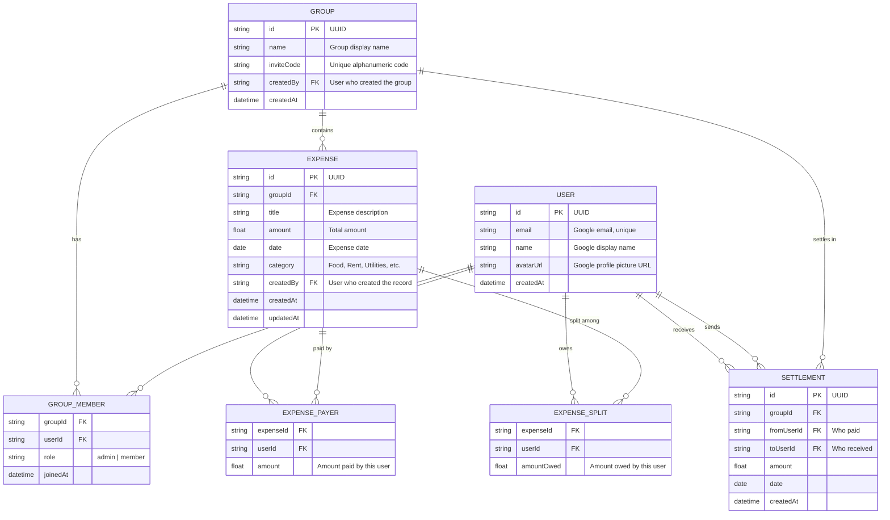

# Spec: ShareSquare
> Version: 0.1 | Status: Draft | Last updated: 2026-03-10

---

## 1. Overview

### Problem Statement
Splitting expenses among friends, roommates, and family is a common source of friction and confusion. Existing solutions are either too complex (full accounting apps) or locked behind app-store distribution and subscriptions. Users need a lightweight, browser-first tool to quickly record shared costs, see who owes whom, and settle up — without creating yet another account with a new password.

### Goals
- Provide a frictionless way to track shared expenses across multiple groups
- Calculate and display clear "who owes whom" balances with debt simplification
- Deliver a mobile-first PWA that works offline and feels native
- Store data portably in JSON with import/export capability
- Authenticate exclusively via Google OAuth for zero-password onboarding

### Non-Goals
- Real-time payment processing (Venmo, PayPal, bank transfers)
- Multi-currency support (MVP is single-currency: USD)
- Native iOS/Android app store distribution
- Social features (comments, reactions, chat)
- Receipt scanning / OCR
- Recurring/scheduled expenses

### Success Metrics
| Metric | Target | How Measured |
|--------|--------|--------------|
| Onboarding completion rate | >95% | Google OAuth sign-in success |
| Time to add first expense | <60s | Frontend timing event |
| Group invite acceptance rate | >70% | Invite code usage tracking |
| Offline capability | Core flows work offline | Service worker cache audit |
| Data export reliability | 100% round-trip fidelity | Import/export integration test |

---

## 2. Users & Journeys

### User Personas
**Primary:** Alex (Roommate) — A 25-year-old sharing an apartment with 3 others, splitting rent, utilities, groceries, and dining expenses monthly.

**Secondary:** Priya (Trip Organizer) — A 30-year-old who organizes group trips and needs to track shared costs across 6–8 friends for a limited time period.

**Tertiary:** Sam (Casual Splitter) — A college student who occasionally splits coffee runs and takeout with a small rotating group.

### Key User Journeys

#### Journey 1: First-Time Sign-Up & Group Creation
**As a** new user, **I want to** sign in with my Google account and create my first group **so that** I can start tracking expenses immediately.

Steps:
1. User lands on the landing/login page
2. User taps "Sign in with Google"
3. Google OAuth flow completes, user is authenticated
4. System creates a profile from Google account data (name, avatar, email)
5. User is redirected to the Home/Dashboard (empty state)
6. User taps "+" FAB or "Create Group" button
7. User enters group name (e.g., "Apt 4B - Rent & Bills")
8. System generates a unique invite code (e.g., "APT4B-2026")
9. User sees the new group with the invite code to share

**Happy path exit:** User sees the group detail page with 1 member (themselves) and a shareable invite code.
**Failure path:** Google OAuth denied → show error message with retry. Network offline → queue group creation for sync when online.

#### Journey 2: Joining an Existing Group
**As an** existing user, **I want to** join a group using an invite code **so that** I can participate in shared expense tracking.

Steps:
1. User navigates to Groups tab
2. User taps "Join Group" and enters the alphanumeric invite code
3. System validates the code and adds user to the group
4. User sees the group detail page with existing members and expenses

**Happy path exit:** User is now a member of the group and can see all shared expenses.
**Failure path:** Invalid code → show "Code not found, check and try again." Group already joined → show "You're already a member of this group."

#### Journey 3: Adding an Expense
**As a** group member, **I want to** add an expense with a flexible split **so that** everyone's share is accurately recorded.

Steps:
1. User taps "Add Expense" from the bottom nav or group detail
2. User fills in: Description, Date, Amount, Category
3. User selects "Who Paid" (single payer or group fund)
4. User selects split method: Equal Split, Exact Amounts, or Custom Percentages
5. If not equal split, user adjusts individual amounts/percentages
6. System validates that splits sum to the total amount
7. User taps "Save Expense"
8. System records the expense and recalculates all balances

**Happy path exit:** Expense appears in the group's expense list; balances update instantly.
**Failure path:** Splits don't sum to total → show validation error, prevent save. Missing required fields → inline validation errors.

#### Journey 4: Viewing Balances & Settling Up
**As a** group member, **I want to** see who owes whom and record settlements **so that** debts are tracked and cleared.

Steps:
1. User views group detail page showing member balances
2. User sees overall "You Owe" and "Owed to You" on dashboard
3. User can view a simplified debt graph (minimized transactions)
4. User records a settlement payment between two members
5. Balances update to reflect the settlement

**Happy path exit:** Balance matrix shows accurate, simplified debts across all group members.
**Failure path:** No expenses yet → show empty state with prompt to add first expense.

#### Journey 5: Exporting & Importing Data
**As a** user, **I want to** export all my data as JSON **so that** I have a portable backup and can re-import it later.

Steps:
1. User navigates to Settings
2. User taps "Export Data"
3. System generates a complete JSON file of all user data (groups, expenses, settlements)
4. Browser downloads the `.json` file
5. To import, user taps "Import Data" and selects a previously exported file
6. System validates the JSON schema and merges/replaces data

**Happy path exit:** Data is exported/imported with 100% fidelity.
**Failure path:** Invalid JSON schema → show parsing error with details. Conflicting IDs on import → prompt user to overwrite or skip.

---

## 3. Feature List

| # | Feature | Priority | Notes |
|---|---------|----------|-------|
| F-01 | Google OAuth Sign-In | Must | SSO-only, no email/password |
| F-02 | User Profile (from Google) | Must | Name, avatar, email pulled automatically |
| F-03 | Create Group | Must | Name + auto-generated invite code |
| F-04 | Join Group via Invite Code | Must | Alphanumeric code entry |
| F-05 | Dashboard / Home Screen | Must | Overall balance, recent groups, quick actions |
| F-06 | Group Detail View | Must | Total expenses, member balances, expense list |
| F-07 | Add Expense (CRUD) | Must | Description, amount, date, category, payer, splits |
| F-08 | Equal Split | Must | Divide evenly among selected members |
| F-09 | Exact Amount Split | Must | Manually enter each member's share |
| F-10 | Percentage Split | Must | Assign percentages per member |
| F-11 | Edit / Delete Expense | Must | Modify or remove existing expenses |
| F-12 | Balance Calculation | Must | Real-time per-group and cross-group balances |
| F-13 | Debt Simplification | Should | Minimize transactions algorithm |
| F-14 | Settlement Recording | Must | Record payments between members |
| F-15 | Expense List with Filters | Should | Filter by date, category, amount; sort options |
| F-16 | Data Visualization (SVG Charts) | Could | Segmented bar charts, flow diagrams |
| F-17 | JSON Data Export | Must | Complete data download as .json |
| F-18 | JSON Data Import | Must | Upload and restore from .json file |
| F-19 | Markdown Export | Could | Export data as readable .md |
| F-20 | PWA / Offline Support | Must | Service worker, offline caching |
| F-21 | Bottom Navigation Bar | Must | Dashboard, Groups, Add Expense, Activity, Settings |
| F-22 | Activity Feed | Should | Chronological log of all actions across groups |
| F-23 | Local Persistence (IndexedDB) | Must | Cache state for offline-first interactions |
| F-24 | Repository Pattern Data Layer | Must | Abstract storage for future backend migration |

---

## 4. Data Model

### Entities

### Key Relationships
- **User** to **Group**: Many-to-many through GroupMember (a user can be in multiple groups, a group has multiple members)
- **Group** to **Expense**: One-to-many (each expense belongs to exactly one group)
- **Expense** to **ExpensePayer**: One-to-many (an expense can have one or more payers)
- **Expense** to **ExpenseSplit**: One-to-many (an expense is split among one or more members)
- **Group** to **Settlement**: One-to-many (settlements occur within a group context)
- **User** to **Settlement**: A settlement has a sender (fromUser) and receiver (toUser)

---

## 5. Business Rules

| ID | Rule | Enforcement |
|----|------|------------|
| BR-01 | The sum of all ExpensePayer amounts must equal the Expense total amount | Frontend validation + data layer check |
| BR-02 | The sum of all ExpenseSplit amountOwed must equal the Expense total amount | Frontend validation + data layer check |
| BR-03 | Only group members can add expenses to a group | Frontend route guard + data layer check |
| BR-04 | Only the expense creator or group admin can edit/delete an expense | Frontend UI + data layer check |
| BR-05 | Invite codes must be unique across all groups | Generated with collision check |
| BR-06 | A user cannot join a group they are already a member of | Data layer duplicate check |
| BR-07 | Debt simplification recalculates after every expense or settlement change | Triggered on write operations |
| BR-08 | Category must be one of a predefined set: Food, Rent, Utilities, Transport, Entertainment, Shopping, Health, Travel, Other | Frontend dropdown + data layer validation |
| BR-09 | Expense amount must be greater than zero | Frontend + data layer validation |
| BR-10 | Settlement amount must be greater than zero | Frontend + data layer validation |
| BR-11 | A group must have at least one member (the creator) at all times | Prevent creator from leaving; only delete group |
| BR-12 | Exported JSON must pass schema validation on import | Import validation with error reporting |
| BR-13 | Expense date cannot be in the future (max: today) | Frontend date picker constraint |

---

## 6. Security & Compliance

- **Authentication:** Google OAuth 2.0 (SSO-only). No email/password flow. JWT or session token stored in secure, httpOnly cookie or localStorage depending on deployment context.
- **Authorization:** Role-based within groups — `admin` (group creator) can edit group settings and remove members; `member` can add/edit own expenses and view all group data.
- **Sensitive Data:** Email addresses (PII). No financial account numbers or passwords stored. Google OAuth tokens handled per Google's security guidelines.
- **Compliance:** No specific regulatory compliance required for MVP (no payment processing). GDPR consideration: users can export and delete all their data.
- **Rate Limiting:** Not applicable for MVP (local-first architecture). If backend is added later, standard rate limiting should be applied.
- **Data at Rest:** Local data stored in IndexedDB/localStorage is not encrypted (browser standard). Exported JSON files are plaintext — user responsibility to secure.

---

## 7. Out of Scope (v1)

- Real-time payment integration (Venmo, PayPal, Stripe, bank transfers)
- Multi-currency support and exchange rates
- Native mobile apps (iOS / Android app store builds)
- Recurring / scheduled expenses
- Receipt scanning / OCR
- Social features (comments, reactions, likes on expenses)
- Push notifications
- Real-time collaborative editing (live sync between users)
- Backend server / database (MVP is local-first with JSON export)
- User search / discovery (groups are invite-code only)
- Expense attachments (images, documents)
- Tax calculation or reporting
- Budget tracking or spending limits
- Group chat or messaging
