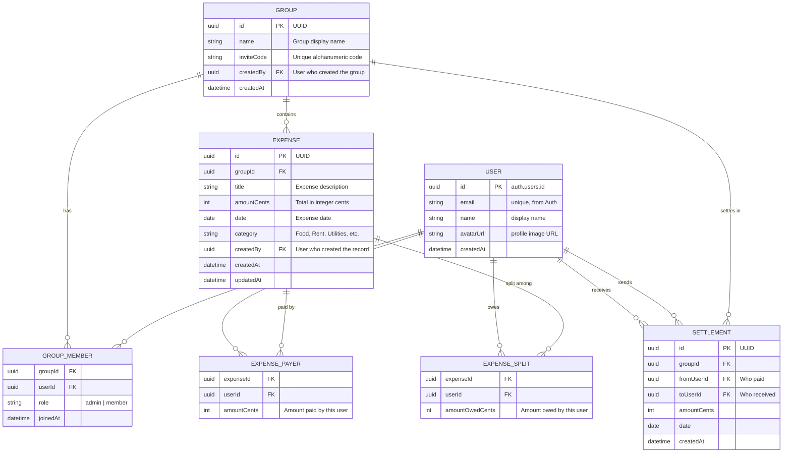

# Spec: ShareSquare

> Version: 1.0 | Status: Released (MVP) | Last updated: 2026-03-31

---

## 1. Overview

### Problem Statement

Splitting expenses among friends, roommates, and family is a common source of friction and confusion. Existing solutions are either too complex (full accounting apps) or locked behind app-store distribution and subscriptions. Users need a lightweight, browser-first tool to quickly record shared costs, see who owes whom, and settle up — with minimal account friction via managed authentication.

### Goals

- Provide a frictionless way to track shared expenses across multiple groups
- Calculate and display clear "who owes whom" balances with debt simplification
- Deliver a mobile-first **online-first** PWA: installable shell, fast load, and **service worker caching for static assets**; core data operations require network connectivity to Supabase
- Persist authoritative data in **Supabase (Postgres)** with portable **JSON import/export**
- Authenticate and provision accounts via **Supabase Auth** (OAuth providers such as Google and/or email magic link are configured in the Supabase project — not a separate client-only OAuth integration)

### Non-Goals

- Real-time payment processing (Venmo, PayPal, bank transfers)
- Multi-currency **conversion** / exchange rates (display-only currency formatting without FX is in scope; see REQ-032)
- Native iOS/Android app store distribution
- Social features (comments, reactions, chat)
- Receipt scanning / OCR
- Recurring/scheduled expenses
- Full offline CRUD with sync queues (out of scope for MVP)

### Success Metrics

| Metric                       | Target                         | How Measured                         |
| ---------------------------- | ------------------------------ | ------------------------------------ |
| Onboarding completion rate   | >95%                           | Supabase Auth sign-in success        |
| Time to add first expense    | <60s                           | Frontend timing event                |
| Group invite acceptance rate | >70%                           | Invite code usage tracking           |
| PWA shell & assets           | Cached for fast repeat visits  | Service worker / precache audit      |
| Data export reliability      | 100% round-trip fidelity       | Import/export integration test       |

---

## 2. Users & Journeys

### User Personas

**Primary:** Alex (Roommate) — A 25-year-old sharing an apartment with 3 others, splitting rent, utilities, groceries, and dining expenses monthly.

**Secondary:** Priya (Trip Organizer) — A 30-year-old who organizes group trips and needs to track shared costs across 6–8 friends for a limited time period.

**Tertiary:** Sam (Casual Splitter) — A college student who occasionally splits coffee runs and takeout with a small rotating group.

### Key User Journeys

#### Journey 1: First-Time Sign-Up & Group Creation

**As a** new user, **I want to** sign in via Supabase Auth and create my first group **so that** I can start tracking expenses immediately.

Steps:

1. User lands on the landing/login page
2. User starts sign-in (e.g. OAuth provider enabled in Supabase such as Google, or email magic link — exact methods depend on project configuration)
3. Supabase Auth completes; user session is established
4. System ensures a **profile** row (or equivalent) linked to `auth.users.id` with display name, avatar, and email from Auth user metadata
5. User is redirected to the Home/Dashboard (empty state)
6. User taps "+" FAB or "Create Group" button
7. User enters group name (e.g., "Apt 4B - Rent & Bills")
8. System generates a unique invite code (e.g., "APT4B-2026") and persists the group in Supabase
9. User sees the new group with the invite code to share

**Happy path exit:** User sees the group detail page with 1 member (themselves) and a shareable invite code.
**Failure path:** Auth cancelled or failed → show error with retry. **Network offline** → show that connection is required; do not promise queued sync for MVP.

#### Journey 2: Joining an Existing Group

**As an** existing user, **I want to** join a group using an invite code **so that** I can participate in shared expense tracking.

Steps:

1. User navigates to Groups tab
2. User taps "Join Group" and enters the alphanumeric invite code
3. System validates the code against Supabase and adds user to the group
4. User sees the group detail page with existing members and expenses

**Happy path exit:** User is now a member of the group and can see all shared expenses.
**Failure path:** Invalid code → show "Code not found, check and try again." Group already joined → show "You're already a member of this group." Offline → prompt to reconnect.

#### Journey 3: Adding an Expense

**As a** group member, **I want to** add an expense with a flexible split **so that** everyone's share is accurately recorded.

Steps:

1. User taps "Add Expense" from the bottom nav or group detail
2. User fills in: Description, Date, Amount, Category
3. User selects "Who Paid" (single payer or group fund)
4. User selects split method: Equal Split, Exact Amounts, or Custom Percentages
5. If not equal split, user adjusts individual amounts/percentages
6. System validates that splits sum to the total amount
7. User taps "Save Expense"
8. System records the expense in Supabase and recalculates all balances

**Happy path exit:** Expense appears in the group's expense list; balances update after successful write.
**Failure path:** Splits don't sum to total → show validation error, prevent save. Missing required fields → inline validation errors. Network/API error → user-visible error with retry.

#### Journey 4: Viewing Balances & Settling Up

**As a** group member, **I want to** see who owes whom and record settlements **so that** debts are tracked and cleared.

Steps:

1. User views group detail page showing member balances
2. User sees overall "You Owe" and "Owed to You" on dashboard
3. User can view a simplified debt graph (minimized transactions)
4. User records a settlement payment between two members
5. Balances update to reflect the settlement

**Happy path exit:** Balance matrix shows accurate, simplified debts across all group members.
**Failure path:** No expenses yet → show empty state with prompt to add first expense.

#### Journey 5: Exporting & Importing Data

**As a** user, **I want to** export all my data as JSON **so that** I have a portable backup and can re-import it later.

Steps:

1. User navigates to Settings
2. User taps "Export Data"
3. System aggregates from Supabase (via repositories) and generates a complete JSON file of permitted user data (groups, expenses, settlements, etc.)
4. Browser downloads the `.json` file
5. To import, user taps "Import Data" and selects a previously exported file
6. System validates the JSON schema and merges/replaces data per product rules

**Happy path exit:** Data is exported/imported with 100% fidelity.
**Failure path:** Invalid JSON schema → show parsing error with details. Conflicting IDs on import → prompt user to overwrite or skip.

---

## 3. Feature List

| #    | Feature                              | Priority | Notes                                                                 |
| ---- | ------------------------------------ | -------- | --------------------------------------------------------------------- |
| F-01 | Supabase Auth sign-in                | Must     | Providers (e.g. Google OAuth, email magic link) configured in Supabase |
| F-02 | User profile                         | Must     | Name, avatar, email from Auth metadata / `profiles` (or equivalent)   |
| F-03 | Create Group                         | Must     | Name + auto-generated invite code; persisted in Postgres            |
| F-04 | Join Group via Invite Code           | Must     | Alphanumeric code entry; resolve via Supabase                         |
| F-05 | Dashboard / Home Screen              | Must     | Overall balance, recent groups, quick actions                         |
| F-06 | Group Detail View                    | Must     | Total expenses, member balances, expense list                       |
| F-07 | Add Expense (CRUD)                   | Must     | Description, amount, date, category, payer, splits                    |
| F-08 | Equal Split                          | Must     | Divide evenly among selected members                                  |
| F-09 | Exact Amount Split                   | Must     | Manually enter each member's share                                    |
| F-10 | Percentage Split                     | Must     | Assign percentages per member                                         |
| F-11 | Edit / Delete Expense                | Must     | Modify or remove existing expenses                                    |
| F-12 | Balance Calculation                  | Must     | Per-group and cross-group balances from server data                   |
| F-13 | Debt Simplification                  | Should   | Minimize transactions algorithm                                     |
| F-14 | Settlement Recording                 | Must     | Record payments between members                                       |
| F-15 | Expense List with Filters            | Should   | Filter by date, category, amount; sort options                      |
| F-16 | Data Visualization (SVG Charts)      | Could    | Segmented bar charts, flow diagrams                                   |
| F-17 | JSON Data Export                     | Must     | Complete data download as .json                                       |
| F-18 | JSON Data Import                     | Must     | Upload and restore from .json file                                    |
| F-19 | Markdown Export                      | Could    | Export data as readable .md                                         |
| F-20 | PWA (online-first)                   | Must     | Service worker precache of shell/assets; data requires network        |
| F-21 | Bottom Navigation Bar                | Must     | Dashboard, Groups, Add Expense, Activity, Settings                  |
| F-22 | Activity Feed                        | Should   | Chronological log of actions across groups                          |
| F-23 | Remote persistence (Supabase Postgres) | Must   | Authoritative store; RLS enforces access (see Security)               |
| F-24 | Repository pattern data layer        | Must     | Interfaces implemented with Supabase client in MVP                  |

---

## 4. Data Model

### Entities

Logical model below. **User** identity aligns with Supabase **`auth.users.id`** (UUID). Application-facing profile fields may live in a **`profiles`** table (or equivalent) keyed by that id.

### Key Relationships

- **User** to **Group**: Many-to-many through GroupMember (a user can be in multiple groups, a group has multiple members)
- **Group** to **Expense**: One-to-many (each expense belongs to exactly one group)
- **Expense** to **ExpensePayer**: One-to-many (an expense can have one or more payers)
- **Expense** to **ExpenseSplit**: One-to-many (an expense is split among one or more members)
- **Group** to **Settlement**: One-to-many (settlements occur within a group context)
- **User** to **Settlement**: A settlement has a sender (fromUser) and receiver (toUser)

---

## 5. Business Rules

| ID    | Rule                                                                                                                       | Enforcement                                     |
| ----- | -------------------------------------------------------------------------------------------------------------------------- | ----------------------------------------------- |
| BR-01 | The sum of all ExpensePayer amounts must equal the Expense total amount                                                    | Frontend validation + data layer check          |
| BR-02 | The sum of all ExpenseSplit amountOwed must equal the Expense total amount                                                 | Frontend validation + data layer check          |
| BR-03 | Only group members can add expenses to a group                                                                             | Frontend route guard + RLS / data layer         |
| BR-04 | Only the expense creator or group admin can edit/delete an expense                                                         | Frontend UI + RLS / data layer                  |
| BR-05 | Invite codes must be unique across all groups                                                                              | DB unique constraint + client retry on conflict |
| BR-06 | A user cannot join a group they are already a member of                                                                    | Data layer duplicate check                      |
| BR-07 | Debt simplification recalculates after every expense or settlement change                                                  | Triggered on write operations                   |
| BR-08 | Category must be one of a predefined set: Food, Rent, Utilities, Transport, Entertainment, Shopping, Health, Travel, Other | Frontend dropdown + data layer validation       |
| BR-09 | Expense amount must be greater than zero                                                                                   | Frontend + data layer validation                |
| BR-10 | Settlement amount must be greater than zero                                                                                | Frontend + data layer validation                |
| BR-11 | A group must have at least one member (the creator) at all times                                                           | Prevent creator from leaving; only delete group |
| BR-12 | Exported JSON must pass schema validation on import                                                                        | Import validation with error reporting          |
| BR-13 | Expense date cannot be in the future (max: today)                                                                          | Frontend date picker constraint                 |

---

## 6. Security & Compliance

- **Authentication:** Supabase Auth. Session and JWT refresh are handled by the Supabase client; no separate in-app Google Identity Services token exchange. Which providers are offered (OAuth, magic link, etc.) is controlled in the Supabase dashboard.
- **Authorization:** Role-based within groups — `admin` (group creator) can edit group settings and remove members; `member` can add/edit own expenses (per rules) and view group data they belong to. **Row Level Security (RLS)** on Postgres tables enforces tenant and membership rules; the app must not rely on UI alone.
- **Sensitive Data:** Email addresses (PII). No financial account numbers or app-managed passwords (when using OAuth/magic link). OAuth secrets stay server-side in Supabase configuration.
- **Compliance:** No specific regulatory compliance required for MVP (no payment processing). GDPR consideration: users can export and delete their data (Supabase Auth deletion + app data policies).
- **Rate limiting:** Subject to Supabase project quotas and hosting platform limits; design APIs and client usage to avoid abusive patterns.
- **Data at rest:** Postgres on Supabase (managed encryption at rest per provider). Exported JSON files are plaintext — user responsibility to secure.

---

## 7. Out of Scope (v1)

- Real-time payment integration (Venmo, PayPal, Stripe, bank transfers)
- Multi-currency support and exchange rates
- Native mobile apps (iOS / Android app store builds)
- Recurring / scheduled expenses
- Receipt scanning / OCR
- Social features (comments, reactions, likes on expenses)
- Push notifications
- Real-time collaborative editing (live cursor sync; standard request/response + optional future Realtime is not required for MVP)
- Self-hosted Postgres / custom backend **outside** Supabase for MVP (Supabase is the BaaS)
- User search / discovery (groups are invite-code only)
- Expense attachments (images, documents)
- Tax calculation or reporting
- Budget tracking or spending limits
- Group chat or messaging
- Guaranteed offline expense CRUD with background sync
